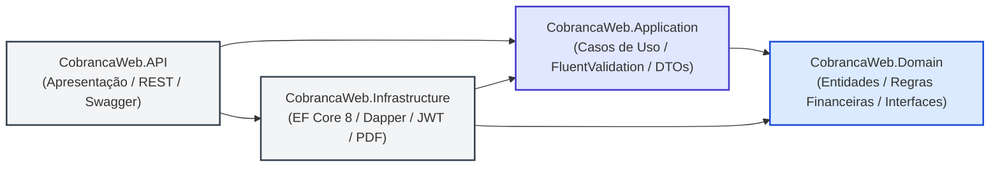
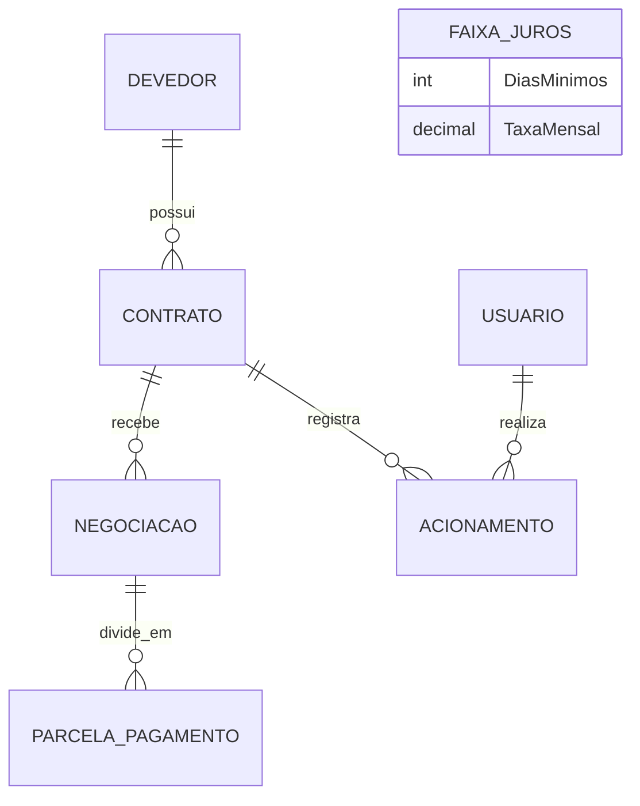
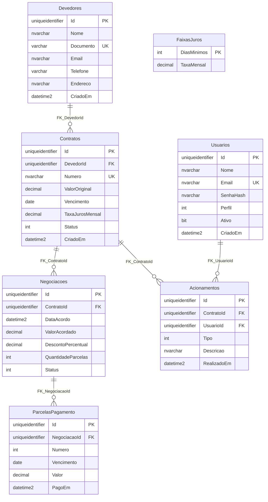

# Cobrança Web

> Sistema de cobrança em .NET 8 + SQL Server

## Estrutura

- A solution está dividida em Domain, Application, Infrastructure, API e Tests.
- A migration EF Core cria tabelas, restrições, índices, view e procedures, então o script `database/seed_data.sql` insere dados de exemplo.
- O domínio modela devedores, contratos, negociações, parcelas, acionamentos e usuários, e também calcula atraso e juros e registra pagamentos.
- A infraestrutura usa EF Core 8 para mapear as entidades, implementar repositórios e versionar o esquema com uma migration inicial.
- A API tem apenas a estrutura básica e o Swagger em desenvolvimento, e os serviços de aplicação.

## Arquitetura

O backend está organizado em camadas seguindo a **Clean Architecture**: a API e a infraestrutura dependem das camadas internas. O domínio contém entidades com algumas regras de negócio, como cálculo de juros e transição de status. E parte das regras também está nos serviços e validadores da Application.

### Diagrama de Dependência entre Camadas

A regra de dependência é estrita: as camadas externas dependem das internas, e o **Domain** é o núcleo puro independente.



## Decisões e padrões

- Repository separa o acesso a dados das regras de negócio. Os repositórios EF Core compartilham o `AppDbContext` para salvar alterações.
- EF Core 8 usa Fluent API para mapear chaves, relações, índices e restrições. Dapper atende consultas de relatórios e stored procedures.
- A migration é a fonte do esquema todo do banco e depois de aplicá-la, execute o seed para carregar dados de exemplo.

---

## MER

O conceitual modelo entidade-relacionamento representa o seguinte fluxo de cobrança: um devedor possui contratos, então cada contrato pode ter negociações e acionamentos e cada negociação possui parcelas, portanto, cada acionamento é registrado por um usuário. As faixas de juros definem parâmetros de cálculo e, no modelo atual, não têm relacionamento direto com contrato.



## DER

O diagrama de entidade e relacionamento resume as tabelas criadas pela migration, sendo que `Id` é `uniqueidentifier` nas entidades que herdam de `BaseEntity`.



## Carregar Dados

Para criar a base local e carregar os dados de exemplo:

```powershell
dotnet ef database update --project src/CobrancaWeb.Infrastructure --startup-project src/CobrancaWeb.Infrastructure
sqlcmd -S "(localdb)\MSSQLLocalDB" -E -i database/seed_data.sql
```
