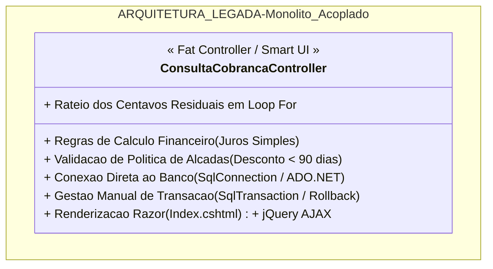
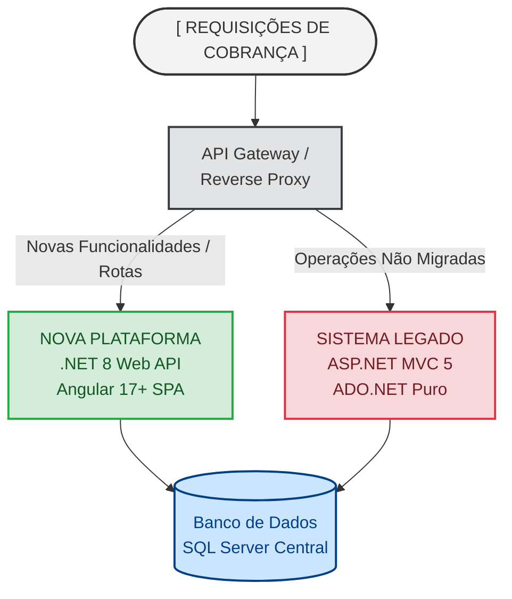

# Migração e Modernização Arquitetural

## Cobrança Web migrando do Monólito ASP.NET MVC / ADO.NET para .NET 8 Clean Architecture

### Sumário

Este documento apresenta a análise e diagnóstico de débitos técnicos e o plano de migração do módulo operacional legado de recuperação de crédito do **Cobrança Web**.

O sistema original (legado) foi concebido sobre uma arquitetura monolítica clássica baseada em **ASP.NET MVC 5** e **ADO.NET puro** (usando `SqlConnection`, `SqlCommand`, `SqlDataReader`), foi muito funcional no início, porém o acoplamento crítico entre regras de negócio, persistência de dados e apresentação visual, inviabiliza testes automatizados, evolucão da solução e escalabilidade.

A nova arquitetura em **.NET 8 (C# 12)** com **Clean Architecture**, **Entity Framework Core 8** e **Dapper** substitui o legado preservando 100% das regras operacionais, garantindo alta performance, segurança e testabilidade com cobertura automatizada.

---

### Diagnóstico de Débitos Técnicos

A análise do código legado (`ConsultaCobrancaController.cs` e `legacy-cobranca.js`) identificou os seguintes anti-patterns:

#### Os 5 Principais Problemas Diagnosticados:

1. **Fat Controller / Smart UI**
   As ações de controle acumulam muitas responsabilidades, temos ali:
    - orquestração HTTP;
    - cálculos financeiros;
    - validações de alçada de desconto;
    - controle transacional;
    - mapeamento de dados.

    Na parte de **S.O.L.I.D** vemos ali violação direta de:
    - Princípio da Responsabilidade Única (SRP);
    - Princípio Aberto/Fechado (OCP).

2. **Acoplamento Extremo com o Provedor de Banco de Dados**
   Uso de `SqlConnection` e queries SQL literais dispersas nos métodos de ação, então qualquer alteração em índices, nomes de colunas ou migração de banco demanda alteração e recompilação do controller.

    Tratamento manual de conexões e risco de vazamento de pool se um bloco `using` ou `SqlDataReader` não for fechado em exceções não tratadas.

3. **Inviabilidade de Testes Automatizados**
   Como os métodos instanciam diretamente new `SqlConnection(...)`, é impossível isolar a lógica de cálculo financeiro ou as regras de aprovação em testes de unidade sem uma conexão ativa com o SQL Server.

4. **Tratamento de Transacão Realizado de Forma Manual e Frágil**
   Bloqueios manuais usando `WITH (UPDLOCK)` e manipulação explícita de `SqlTransaction` sujeitos a deadlocks sob alta concorrência de operadores de cobrança, que seria uma situação em que dois ou mais processos ficam permanentemente bloqueados, esperando uns pelos outros para liberar recursos

5. **Interface Monolítica Acoplada ao Servidor**
   Views Razor misturam HTML, estilos Bootstrap 3 e scripts jQuery com chamadas assíncronas não tipadas, impossível de reutilizar em canais digitais modernos como App Mobile, Autoatendimento Web, APIs de Parceiros.

---

### Identificação das Regras de Negócio

A inspeção detalhada do código legado revelou 4 regras centrais de negócio na parte do domínio de recuperação de crédito:

#### Regra 1 | Cálculo da Dívida Corrigida - O Famoso Juros de Mora

- **Comportamento Legado:**
  Os juros moratórios são calculados pelo modelo de juros simples proporcionais aos dias de atraso a partir da data de vencimento.
- **Está assim:**
  $$\text{DiasAtraso} = \max(0, \text{DataAtual} - \text{DataVencimento})$$
  $$\text{FatorJuros} = \text{TaxaJurosMensal} \times \left(\frac{\text{DiasAtraso}}{30}\right)$$
  $$\text{ValorAtualizado} = \text{round}\Big(\text{ValorOriginal} \times (1 + \text{FatorJuros}), 2\Big)$$

#### Regra 2 | Alçada e Política de Desconto Progressivo

- **Comportamento Legado:**
  Para evitar riscos e preservar margens em dívidas recentes, contratos com **menos de 90 dias de atraso** possuem teto máximo de **30% de desconto**.
- **Está assim:**
  $$\text{Se } \text{DiasAtraso} < 90 \implies \text{Desconto} \le 30.00\%$$
- Portanto contratos com 90 dias ou mais estão liberados para descontos maiores conforme parametrização comercial.

#### Regra 3 | Rateio de Parcelas com Ajuste de Centavos - Resíduo de Arredondamento

- **Comportamento Legado:**
  Na divisão do valor acordado pelo número de parcelas, a diferença de centavos é obrigatoriamente alocada na **primeira parcela**, garantindo que a soma exata das parcelas seja idêntica ao valor acordado.
- **Está assim:**
  $$\text{ValorBase} = \text{round}\left(\frac{\text{ValorTotal}}{N}, 2\right)$$
  $$\text{Resíduo} = \text{ValorTotal} - (\text{ValorBase} \times N)$$
  $$\text{Parcela}_1 = \text{ValorBase} + \text{Resíduo}$$
  $$\text{Parcela}_i = \text{ValorBase} \quad (\forall i \in \{2, \dots, N\})$$

#### Regra 4 | Transição de Estados do Contrato

- Ao fechar o acordo, o contrato em atraso (`Status = 1 [EmAberto]`) deve transicionar atomicamente para `Status = 2 [Negociado]`, gerando o registro mestre de `Negociacao` e as $N$ parcelas vinculadas em `ParcelasPagamento`.

---

### Matriz De-Para Arquitetural para Rastrear a Migração

A tabela abaixo detalha o mapeamento funcional do código legado para a nova arquitetura em **.NET 8 Clean Architecture**:

| Recurso / Responsabilidade Legada        | Componente Legado (MVC / ADO.NET)                     | Destino na Clean Architecture (.NET 8)                                   | Padrão / Benefício                                                                                            |
| ---------------------------------------- | ----------------------------------------------------- | ------------------------------------------------------------------------ | ------------------------------------------------------------------------------------------------------------- |
| **Consulta de Inadimplentes**            | `ConsultaCobrancaController.Index` (Query SQL inline) | `CobrancaWeb.Infrastructure.Repositories.ContratoReadOnlyRepository`     | **CQRS / Dapper**: Query otimizada via Stored Procedure sem tracking do EF.                                   |
| **Cálculo de Atualização da Dívida**     | Bloco inline no `SimularAcordo`                       | `CobrancaWeb.Domain.Entities.Contrato.CalcularDividaAtualizada()`        | **Entidade de Domínio Rico**: Encapsulamento de regras que não tem dependência de IO.                         |
| **Validação de Alçada (Desconto < 90d)** | `if (diasAtraso < 90 && desconto > 30)` no Controller | `CobrancaWeb.Application.Validators.NegociacaoValidator`                 | **FluentValidation**: Regras isoladas, reutilizáveis e cobertas por 100% de testes xUnit.                     |
| **Simulação Financeira de Propostas**    | `ConsultaCobrancaController.SimularAcordo`            | `CobrancaWeb.Application.Services.NegociacaoService.SimularAcordoAsync`  | **Application Service**: Orquestração pura desacoplada do protocolo HTTP.                                     |
| **Persistência e Rateio de Parcelas**    | Loop `INSERT INTO ParcelasPagamento` no controller    | `CobrancaWeb.Application.Services.NegociacaoService.EfetivarAcordoAsync` | **Unit of Work & Repository**: Integridade ACID garantida pelo EF Core 8.                                     |
| **Emissão do Instrumento de Acordo**     | Impressão no browser / ausente                        | `CobrancaWeb.Infrastructure.Reporting.TermoAcordoPdfService`             | **QuestPDF**: Geração de documento legal assinado em PDF nativo e veloz.                                      |
| **Autenticação e Permissões**            | Sessão de cookies / `FormsAuthentication`             | `CobrancaWeb.Infrastructure.Security.JwtTokenService`                    | **OAuth 2.0 / JWT Stateless**: Autenticação moderna para SPAs e microserviços.                                |
| **Interface do Usuário**                 | Razor `Index.cshtml` + jQuery `legacy-cobranca.js`    | Frontend SPA **Angular 17+** (Standalone Components + Signals)           | **Reatividade e Tipagem Estrita**: Experiência fluida para operadores e validação client/server sincronizada. |

---

### 5. Estratégia de Migração | Strangler Fig Pattern / Padrão Estrangulador

Para assegurar transição contínua sem interrupção na operação de cobrança, esta migração adota o padrão **Strangler Fig**:

#### Etapas de Execução do Estrangulamento

**Fase 1 | Convivência no Banco de Dados (já foi implementado)**
A nova API em .NET 8 conecta-se ao mesmo banco de dados SQL Server legado, respeitando a estrutura das tabelas existentes `Devedores`, `Contratos`, `Negociacoes`, `ParcelasPagamento`, etc.

**Fase 2 | Estrangulamento das Leituras e Relatórios**
Consultas pesadas de carteira e relatórios operacionais passam a ir para nos novos endpoints via Dapper (`/api/relatorios/resumo-carteira`), reduzindo a carga no servidor IIS legado.

**Fase 3 | Estrangulamento da Formalização de Acordos**
O novo fluxo de negociação com emissão de PDF via QuestPDF substitui os endpoints `SimularAcordo` e `EfetivarAcordo`.

**Fase 4 | Desativação Completa do Legado**:
Quando o frontend Angular 17+ estiver em produção para 100% dos operadores, as rotas do controller legado são desativadas e os servidores legados são desligados com economia de infraestrutura, pelo que lembro isso se chama `Decommissioning`.

---

### Balanço Final

A refatoração total consegue transformar um código monolítico de alto risco de manutenção em uma arquitetura melhorada e com vida longa, permitindo ter:

- **0% de Risco de Quebra de Contratos Existentes**: As regras de cálculo e alçadas foram fielmente migradas e cobertas sob suítes de testes.
- **100% Testável**: 43 testes de unidade cobrem todas as variações de atraso, teto de 30%, rateio de centavos e limites de parcelamento.
- **Pronto para Alta Escala Caso Necessite**: Contando com a separação clara entre leituras ultra-rápidas com Dapper e operações de escrita seguras e consistentes com EF Core 8.

